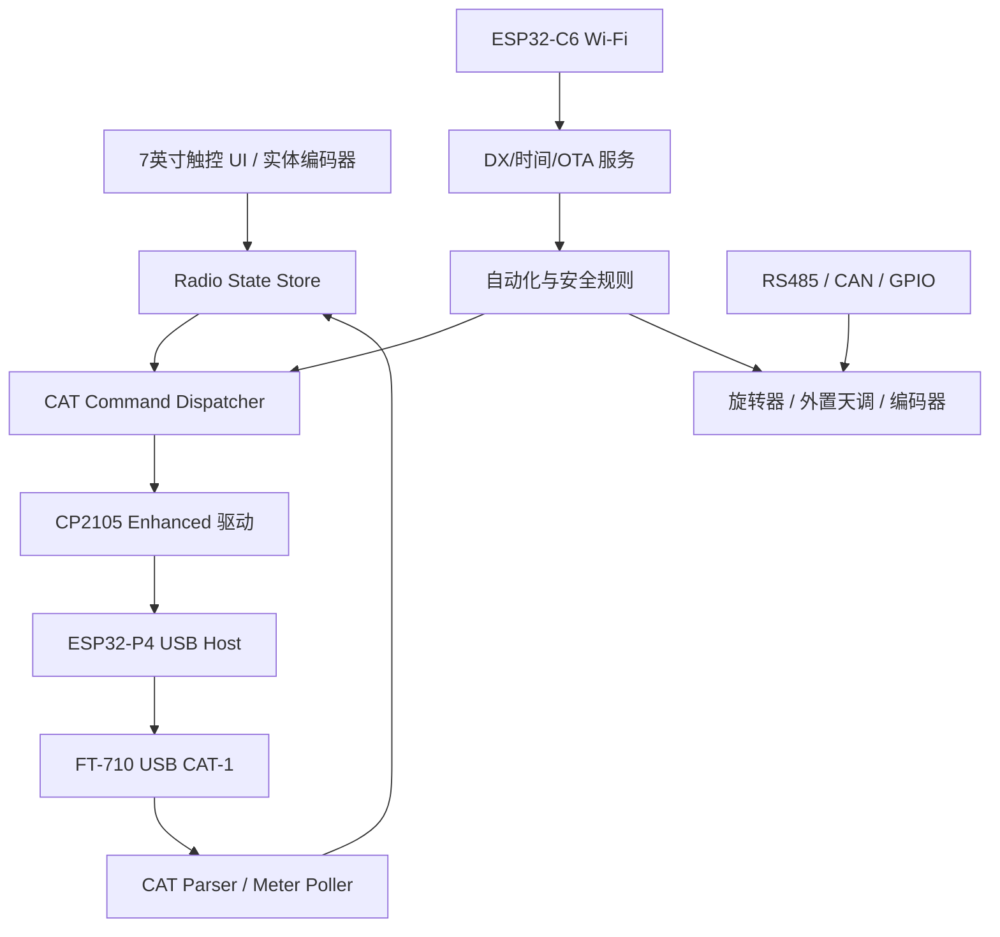
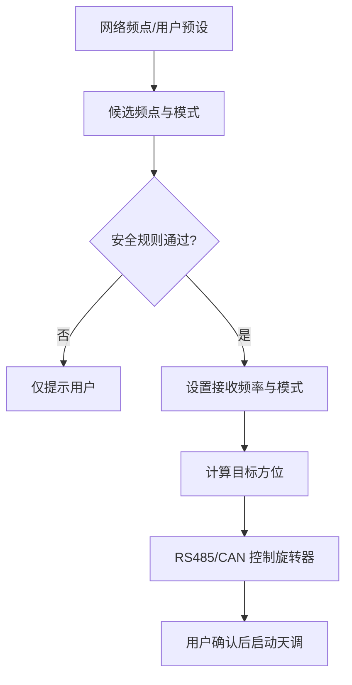

# YAESU FT-710 × Waveshare ESP32-P4-WIFI6-Touch-LCD-7B

## 扩展触控控制器可行性与系统架构方案 v1.0

日期：2026-08-21

## 1. 结论

这个项目可行，建议采用以下主路线：

> 微雪开发板 Type-A USB Host → 普通 USB A-B 线 → FT-710 后部 USB Type-B → CP2105 Enhanced UART（CAT-1）→ Yaesu ASCII CAT 协议

ESP32-P4 负责触控 UI、CAT 协议、状态机和自动化；板载 ESP32-C6 通过 SDIO 提供 Wi-Fi 6/BLE；板载 RS485/CAN/GPIO 用于后续天线旋转器、外置天调、功放或实体旋钮扩展。

开发应使用 ESP-IDF，不建议首版使用 Arduino。微雪当前官方仓库已对 ESP-IDF v5.5.5 和 v6.0.2 进行编译覆盖，并提供 1024×600 MIPI-DSI、GT911 触摸、Wi-Fi、RS485、CAN、NVS 和 FreeRTOS 示例。首版建议固定在微雪示例已经验证的一个版本（优先 v5.5.5），完成实机验证后再升级。

2026-08-22 实测补充：本机已完成 VSCode + ESP-IDF v5.5.5 环境修复，并在真实 ESP32-P4-WIFI6-LCD-TOUCH-7B 开发板上构建、烧写和启动 `08_lvgl_display_panel`。实测板卡芯片为 ESP32-P4 rev v1.3，因此示例需启用 `CONFIG_ESP32P4_SELECTS_REV_LESS_V3=y` 和 `CONFIG_ESP32P4_REV_MIN_100=y`，不能沿用默认 rev v3.0 配置。详细记录见 [[07_开发环境与08_LVGL示例实测记录]]。

项目最大的技术验证点不是 Yaesu CAT 指令，而是：FT-710 使用 CP2105 双 UART USB 设备，需要确认乐鑫 CP210x Host 驱动能否稳定选择 Enhanced Comm Interface。若现成组件只打开第一个通道或不能按接口选择，需要对驱动做一个很小的适配层，按 USB 接口描述符/接口字符串认领 Enhanced 接口。ESP32-P4 的底层 USB Host 本身支持复合设备与多客户端，因此架构上没有根本障碍。

## 2. 硬件平台分析

### 2.1 核心处理与存储

| 模块 | 器件/接口 | 项目用途 | 结论 |
| --- | --- | --- | --- |
| 主处理器 | ESP32-P4NRW32，HP 双核 RISC-V 最高 360 MHz，另有 LP 核 | LVGL UI、USB Host、CAT、自动化、网络服务 | 性能充足 |
| PSRAM | 芯片内封装 32 MB | LVGL 帧缓冲、字体、图标、网络缓存 | 适合 1024×600 UI |
| NOR Flash | 板载 32 MB | 固件、资源、OTA 分区、配置 | 充足 |
| 无线协处理器 | ESP32-C6-MINI-1-N4，经 SDIO 与 P4 通信 | 2.4 GHz Wi-Fi 6、Bluetooth LE | 不能当作 P4 内置无线；版本需与 ESP-Hosted 匹配 |
| TF 卡 | SDIO 3.0 | 日志、配置备份、离线频点表、UI 资源 | 可选，首版不依赖 |

ESP32-P4 自身不含 Wi-Fi/蓝牙射频。微雪板上的 ESP32-C6 是协处理器，应用通过 ESP-Hosted/Remote Wi-Fi 路径使用它。不要独立改刷 C6，除非同时锁定与 `esp_hosted`、`esp_wifi_remote` 兼容的从机固件。

### 2.2 显示与触摸

| 模块 | 器件/接口 | 要点 |
| --- | --- | --- |
| LCD | 7 英寸、1024×600、MIPI-DSI | 由 P4 原生 MIPI-DSI 驱动，适合横屏控制台 |
| 触摸 | GT911，I2C，五点电容触摸 | 首版使用轮询或 BSP 默认方式，避免中断/复位脚配置差异 |
| 背光 | AP3032KTR-G1 升压驱动，GPIO/PWM 控制 | UI 可做自动调光与夜间模式 |

微雪 `08_lvgl_display_panel` 已完成 MIPI-DSI + GT911 + LVGL 的最小验证，`09_lvgl_demo_v9` 可作为 UI 性能基线。不要从空项目手工重新搭建屏幕驱动，应从官方 BSP/示例派生。

### 2.3 USB、串口和扩展总线

| 接口 | 板上实现 | 本项目安排 |
| --- | --- | --- |
| Type-A USB OTG 2.0 HS | ESP32-P4 USB Host，板上含 VBUS 开关/保护 | 专用于 FT-710 USB Type-B |
| Type-C USB 1.1 FS | P4 原生调试/供电 | 固件调试或备用供电 |
| Type-C USB-UART | CH343P | 下载、日志、串口监视 |
| RS485 | THVD1406 或 MAX13487E 自动方向收发器 | 后续旋转器、天调或远端 I/O |
| CAN/TWAI | TJA1051T/3 收发器与保护 | 后续可靠设备总线 |
| UART/I2C/GPIO | PH2.0 接口与 17 个可编程 GPIO | 编码器、按键、传感器、扩展板 |

ESP32-P4 有一个 HS 和一个 FS USB OTG 控制器，但当前 ESP-IDF 软件限制是同一时间只允许一个 USB Host。首版只把 Type-A HS 口作为 Host，其他 Type-C 口只用于设备模式/供电/调试，不设计第二路 USB Host。

### 2.4 音频与其他板载芯片

| 器件 | 功能 | 与首版关系 |
| --- | --- | --- |
| ES8311 | 单声道 ADC/DAC，I2S + I2C | 可做提示音/本地监听，首版 CAT 不依赖 |
| ES7210 | 四通道音频 ADC，板上用于双麦克风/AEC 前端 | 可用于语音控制实验，首版不依赖 |
| NS4150B | 单声道功放 | 驱动板上扬声器接口 |
| ETA6098 | 电源/电池管理 | 不作为项目应用层控制对象 |
| MP1658、RT9193、AP3032 | 主电源、模拟电源、背光电源 | 只需遵守板级电源要求，无需自行写驱动 |

这些音频芯片并不能直接取得 FT-710 的 USB 音频。若未来要从同一根 FT-710 USB 线读取音频，需要另行验证 FT-710 的 USB 复合设备描述符，并增加 USB Audio Class Host；这应作为独立第二阶段，不与首版 CAT 混在一起。

## 3. FT-710 USB 与 CAT 分析

### 3.1 USB 端口结构

FT-710 后部 USB 内置 Silicon Labs 双 UART 桥，对电脑表现为两个虚拟串口：

| 端口 | USB 接口 | 官方用途 | 本项目策略 |
| --- | --- | --- | --- |
| CAT-1 | Enhanced COM Port | 频率、模式及普通 CAT 控制 | 首版唯一认领的端口 |
| CAT-2 | Standard COM Port | PTT、CW、数字模式或第二路 CAT | 首版不认领、不驱动 RTS/DTR |
| CAT-3 | TUNER/LINEAR 口的 5 V TTL UART | CAT；但与外置天调/功放接口冲突 | 不采用，仅作为调试后备 |

FT-710 手册警告：Standard 端口上的 RTS/DTR 配置不当可能导致发射机在主机启动时进入发射。首版只使用 Enhanced/CAT-1，并在软件中默认禁止 `TX`、`MX`、RTS、DTR 控制。

### 3.2 推荐串口参数

首个可工作的基线保持 FT-710 默认设置：

- CAT-1 RATE：38400 bps
- 数据位：8
- 校验：None
- 停止位：2（CAT-1 默认；CAT-2 固定为 1）
- 流控：None
- 命令结束符：`;`

实机稳定后可将 CAT-1 提升到 115200 bps。控制器必须允许在设置页选择 4800/9600/19200/38400/115200 和 1/2 stop bits，防止电台端设置被改变后无法连接。

### 3.3 协议特征

CAT 是无校验和的 ASCII 请求/应答协议，命令为两个字母、固定宽度参数和分号。例如：

```text
FA;             读取 VFO-A 频率
FA014250000;    设置 VFO-A 为 14.250000 MHz
```

必须按分号组帧，不能假定一次 USB Bulk 接收就是一条完整命令。接收器应支持半包、粘包、AI 主动上报与请求应答交错。

### 3.4 首版 UI 与 CAT 指令映射

| 功能 | 读命令 | 写命令/示例 | 说明 |
| --- | --- | --- | --- |
| VFO-A 频率 | `FA;` 或 `IF;` | `FA014250000;` | 9 位 Hz |
| 综合主状态 | `IF;` | — | 含频率、模式、Clarifier、VFO/Memory 等 |
| 模式 | `MD0;` | LSB `MD01;`、USB `MD02;`、FM `MD04;`、DATA-U `MD0C;` | “DATA”按钮默认定义为 DATA-U，并允许用户改为 DATA-L/DATA-FM |
| 波段 | 读当前频率判定 | 3.5 `BS01;`、7 `BS03;`、14 `BS05;`、21 `BS07;`、28 `BS09;`、50 `BS10;` | 对应之前确定的六个触摸按钮 |
| 设定功率 | `PC;` | `PC005;`～`PC100;` | 是目标/设定功率，不是实时输出功率 |
| AF 音量 | `AG0;` | `AG0xxx;`，000～255 | 屏幕滑块或实体编码器 |
| RF Gain | `RG0;` | `RG0xxx;`，000～255 | 常用接收参数 |
| DNR 开关 | `NR0;` | 关 `NR00;`、开 `NR01;` | 与既有 UI 的开/关颜色联动 |
| DNR 等级 | `RL0;` | `RL0xx;`，01～15 | 左右箭头调节 |
| Noise Blanker | `NB0;` | `NB00;`/`NB01;` | 可作为第二页功能 |
| NB Level | `NL0;` | `NL0xxx;`，000～010 | — |
| IPO/Preamp | `PA0;` | `PA00;`/`PA01;`/`PA02;` | IPO/AMP1/AMP2 |
| ATT | `RA0;` | `RA00;`～`RA03;` | OFF/6/12/18 dB |
| AGC | `GT0;` | `GT0x;` | OFF/FAST/MID/SLOW/AUTO |
| IF Shift | `IS0;` | `IS00+1000;` | ±1200 Hz，20 Hz 步进 |
| 带宽 | `SH0;` | `SH00xx;` | 数值含义随模式变化，须按手册表映射 |
| DNF | `BC0;` | `BC00;`/`BC01;` | 自动陷波 |
| Tuner | `AC;` | `AC003;` 启动内/外置天调调谐 | 必须加防误触/状态确认 |
| 收发/告警状态 | `RI0;` | — | RX/TX、Hi-SWR、Tuner、BUSY 等 |
| S 表 | `SM0;` | — | 返回 000～255 |
| 实际功率表 | `RM5;` | — | 返回 000～255 原始表值 |
| SWR 表 | `RM6;` | — | 返回 000～255 原始表值 |
| 固件版本 | `VE0;`～`VE3;` | — | 主 CPU、显示 CPU、SDR、DSP |
| 机型识别 | `ID;` | — | FT-710 应答为 `ID0800;` |

### 3.5 三个协议边界

1. `RM5;` 和 `RM6;` 返回 000～255 的表头值，Yaesu 没有公开其到瓦数或实际 SWR 的公式。首版可显示表盘/百分比；要显示“1.3:1”或“73 W”等精确数值，必须用假负载、功率计/SWR 表与电台显示做多点标定。
2. CAT 的 `SS` 指令只能控制电台自身频谱界面参数，并不输出 FFT/瀑布图采样数据。因此不能仅靠 CAT 在 7 英寸屏上复刻实时频谱。要实现独立瀑布图，需要额外 SDR/IF 采样方案。
3. `EX` 可以读写大量深层菜单，适合把常用菜单做成触摸控件；但首版只开放经过验证的白名单，不能让任意菜单索引直接写入电台。

## 4. 推荐系统架构



### 4.1 固件分层

| 层 | 建议组件 | 职责 |
| --- | --- | --- |
| BSP | 微雪 `waveshare/esp32_p4_wifi6_touch_lcd_7b` | LCD、GT911、背光、SD、音频和板级引脚 |
| OS | ESP-IDF + FreeRTOS | 任务、队列、定时器、NVS、OTA、Watchdog |
| UI | LVGL 9 | 状态栏、频率、模式、波段、参数卡片、设置页 |
| USB | ESP-IDF USB Host Library | 枚举、热插拔、设备生命周期 |
| VCP | `usb_host_vcp` + `usb_host_cp210x_vcp` | CP210x 控制传输、Bulk IN/OUT、UART 参数 |
| CAT Transport | 自研薄层 | 分号组帧、重连、超时、优先队列、日志 |
| CAT Model | 自研 | 指令编码/解码、类型化状态、读写确认 |
| Automation | 自研规则引擎 | 频率/模式/功率/旋转器/天调联动与安全门控 |
| Network | ESP-Hosted/Remote Wi-Fi | NTP、HTTPS/WebSocket、OTA、数据源适配 |

### 4.2 FreeRTOS 任务建议

| 任务 | 优先级思路 | 主要工作 |
| --- | --- | --- |
| `usb_host_daemon` | 高 | USB Host 事件，严禁阻塞 |
| `cp210x_client` | 高 | 设备枚举、接口认领、Bulk 收发、热插拔 |
| `cat_rx_parser` | 高 | 环形缓冲区、按 `;` 组帧、解析应答/AI 上报 |
| `cat_dispatcher` | 中高 | 单一发送出口、每次一个在途请求、超时重试 |
| `radio_poll` | 中 | 根据 RX/TX 状态动态轮询表值与慢变量 |
| `radio_state` | 中 | 单一事实源、时间戳、变更事件、写后确认 |
| `lvgl_ui` | 中 | 唯一执行 LVGL API 的任务，其他任务用消息通知 |
| `network` | 中低 | Wi-Fi、NTP、OTA、远端数据 |
| `automation` | 中低 | 规则评估；通过 dispatcher 发命令，不能直接写 USB |
| `logger` | 低 | NVS/TF 卡调试日志与故障快照 |

### 4.3 状态同步策略

- 上电后发送 `ID;`，只有识别为 `0800` 才进入 FT-710 正常模式。
- 读取 `VE0;`～`VE3;`，把固件版本记录到诊断页。
- 发送 `AI1;` 开启自动状态通知；FT-710 关机后会自动把 AI 恢复为 OFF，因此每次重新连接都要重发。
- 初始全量读取 `IF; PC; AG0; RG0; NR0; RL0; PA0; RA0; GT0; SH0; IS0; RI0;`。
- 触摸写入后不直接把 UI 当作成功，应追加对应读命令确认；若 300～500 ms 内未确认，恢复旧值并显示通信提示。
- 任何时刻只有 `cat_dispatcher` 可以发送命令，避免触摸、轮询和自动化同时写串口。
- AI 上报与查询应答都按 opcode 路由到同一个状态仓库，UI 只订阅状态变化。

### 4.4 动态轮询建议

| 状态 | 快速轮询 | 慢速轮询 |
| --- | --- | --- |
| RX | `SM0;` 5 Hz | `RI0;` 2 Hz，其余状态 0.5～1 Hz |
| TX | `RM5;`、`RM6;` 各 5～10 Hz | `RI0;` 5 Hz，`PC;` 1 Hz |
| USB 不稳定 | 降至 1 Hz并停止自动化 | 连接恢复后全量同步 |

不要对几十个项目固定 10 Hz 全量轮询。38400 bps 足以支撑上述数据量，但电台命令处理和 UI 平滑性更需要优先级与节流。

## 5. USB 双接口实现方案

### 5.1 枚举流程

1. 安装 ESP-IDF USB Host Library，并启动 Host daemon。
2. 注册 VCP/CP210x client。
3. 收到设备接入事件后读取 device/config/interface/string descriptors。
4. 记录 VID、PID、serial、interface number、interface string、Bulk IN/OUT endpoint。
5. 优先通过字符串 `Enhanced` 识别 CAT-1；若 FT-710 固件不提供字符串，再以经过实机记录的 interface number 与 endpoint 组合匹配。
6. 只 claim Enhanced 接口；Standard 接口保持未认领。
7. 配置 38400、8N2、无流控，清空接收缓存。
8. 发送 `ID;` 完成应用层身份确认。

不要只把 VID/PID 写死为 Silicon Labs 默认值，因为 Yaesu 可以在 CP2105 OTP 中定制 VID、PID、产品字符串和接口字符串。最终应保存一次真实 FT-710 的完整描述符快照，作为回归测试 fixture。

### 5.2 驱动适配判断

乐鑫官方组件已经提供通用 VCP 服务和 CP210x Host 驱动，但官方简介只声明“CP210x 系列”，未明确承诺 CP2105 两个 UART 接口同时/按接口选择。因此开发顺序必须是：

1. 先运行 Espressif `cdc_acm_vcp`/CP210x 示例，打印 FT-710 描述符。
2. 验证能否打开 Enhanced 接口并收发 `ID;`。
3. 若只能打开单通道，扩展 open API，增加 `interface_num` 或接口匹配回调。
4. 若两个接口需要独立 vendor control request，按 CP2105 ECI/SCI 的接口索引封装控制传输。

这是一项局部 USB class-driver 适配，不需要更换主控或增加外部 USB-UART 芯片。

## 6. UI 结构建议（延续已确定设计）

### 主界面

- 顶部状态条：FT-710 USB、Wi-Fi、蓝牙、RS485/CAN、时间、RX/TX 状态。
- 大号频率区：VFO-A 频率、步进、VFO/Memory、Clarifier。
- 模式区：四个直接按钮 `LSB / USB / DATA / FM`，当前模式高亮。
- 波段区：`3.5 / 7 / 14 / 21 / 28 / 50 MHz` 六个触摸按钮。
- 常用参数区：RF Power、AF Gain、RF Gain、Width/Shift、IPO/ATT/AGC。
- DNR：左右箭头 + 中间 01～15；开启时青色，关闭时灰色。
- 表头区：RX 时 S Meter；TX 时自动切为 PO/SWR，并突出 Hi-SWR 告警。

### 二级页面

- RX DSP：DNR、NB、DNF、Contour、Notch、Width、Shift。
- TX：功率、Mic Gain、Processor、Monitor、VOX；PTT/MOX 首版隐藏。
- 自动化：频点预设、天线方位、旋转器状态、调谐流程。
- 系统：USB 描述符、CAT 日志、固件版本、Wi-Fi、OTA、时间、温度/电源状态。

### 实体操作

建议至少保留一个主频率编码器和一个带按键的多功能编码器。触摸适合选择，连续微调仍由编码器更可靠。编码器事件进入 UI/命令队列，不直接在 ISR 中发送 CAT。

## 7. 自动化架构与安全边界



自动化应遵守：

- 默认只自动设置接收频率、模式和天线方位，不自动发射。
- `TX`、`MX`、CW keying、数字模式 PTT 单独编译开关，首版关闭。
- 自动调谐需要“频率稳定 + 天线到位 + 功率限制 + 用户确认”四个条件。
- Hi-SWR 时立即停止调谐流程、撤销 CAT PTT，并锁定再次发射控制。
- 旋转器命令需有限位、超时、当前位置反馈和急停输入；网络数据不能直接下发设备命令，必须经过规则引擎。
- 网络源通过 adapter 接口接入，DX Cluster、用户预设或其他服务均转换成统一的 `frequency/mode/callsign/location/timestamp/confidence` 记录。

## 8. 供电、EMC 与结构建议

### 原型阶段

- 开发板用独立、质量可靠的 5 V/3 A USB-C 电源供电。
- Type-A Host 口用短的、带磁环 USB A-B 线连接 FT-710。
- 控制器与电台分开供电，先确认是否存在地环路或发射时 USB 掉线。

### 一体化阶段

- 若从电台 13.8 V 取电，使用带输入保险、反接/浪涌保护、共模/差模滤波的 13.8 V→5 V DC-DC，按峰值留足余量。
- USB、编码器、RS485/CAN 出线处增加 ESD/共模抑制；线束远离 RF 馈线。
- 若发射时出现 CAT 断连、触摸漂移或音频底噪，再增加全速 USB 隔离和隔离电源。不要在没有问题证据时先把隔离器加入首版，因为它会增加枚举与供电变量。
- FT-710 是自供电 USB 设备，但仍依赖 Host VBUS 做连接检测；不能简单断开 USB 5 V 线。

## 9. 分阶段开发计划

### P0：板级验证（1～2 天）

- 跑通 `00_board_check`。
- 跑通 `08_lvgl_display_panel` 和 GT911 触摸坐标。2026-08-22 已完成该示例的构建、烧写和启动日志验证；仍需补充屏幕画面与触摸坐标人工测试记录。
- 跑通 `05_wifistation`。
- 确认 Type-A Host VBUS 与设备接入事件。

验收：屏幕、触摸、Wi-Fi、USB Host 四项独立稳定。

### P1：FT-710 USB/CAT 最小闭环（3～7 天）

- 枚举 FT-710，保存完整 USB 描述符。
- 选中 CP2105 Enhanced 接口。
- `ID;` 得到 `ID0800;`。
- `FA;`、`MD0;`、`PC;` 可读；写入后可读回确认。
- 连续热插拔、开关电台 100 次不死机，不误发射。

这是采购或制作外壳前的硬门槛。

### P2：主界面与状态同步（1～2 周）

- 完成主界面、状态栏、模式/波段/DNR/功率控件。
- 完成 AI + 轮询混合状态同步。
- 完成 TX/RX 表头切换、USB 断线提示和恢复。
- 完成 NVS 设置、日志、Watchdog。

### P3：实体旋钮与深层菜单（1 周）

- 主调谐编码器、步进、长按/短按。
- `EX` 白名单菜单映射。
- 用户配置的 DATA 模式、常用参数和页面布局。

### P4：自动化与外设（2～4 周）

- Wi-Fi 数据源 adapter、NTP、OTA。
- RS485/CAN 旋转器协议。
- 安全规则、限位、超时、人工确认。
- 天调联动与 Hi-SWR 中止。

### P5：射频环境与可靠性

- 100 W 各波段发射抗扰测试。
- USB/CAT 长时间压力、断电恢复、低压/瞬态测试。
- SWR/功率原始值标定。
- 外壳散热、EMC、接地与线束定型。

## 10. 第一版物料与连接

| 项目 | 建议 |
| --- | --- |
| 主板 | Waveshare ESP32-P4-WIFI6-Touch-LCD-7B 标准版，无需摄像头版 |
| CAT 线 | 短 USB 2.0 A-B 屏蔽线，优先带磁环 |
| 开发供电 | 独立 5 V/3 A USB-C 电源 |
| 实体旋钮 | 2 个机械编码器，其中至少 1 个带按键 |
| 外设线 | 微雪对应 PH2.0 线束，先采购 UART/I2C/RS485/CAN 各一套 |
| 调试 | USB-UART Type-C 线；逻辑分析仪可观察外接 UART，但 FT USB CAT 主要看软件日志 |
| 测试 | 50 Ω 假负载、功率/SWR 表；进入 TX 测试前必须具备 |

## 11. 主要风险清单

| 风险 | 级别 | 处理 |
| --- | --- | --- |
| CP2105 双接口选择不被现成驱动完整支持 | 中 | P1 先验证；必要时增加 interface selector/小补丁 |
| Standard 端口 RTS/DTR 导致误发射 | 高 | 首版不认领 CAT-2；软件禁止 PTT 类控制 |
| SWR/PO 只能得到 0～255 原始表值 | 中 | 先表盘显示，后续实机多点标定 |
| CAT 无频谱采样数据 | 确定限制 | 不承诺 CAT 复刻瀑布图；另立 SDR/IF 方案 |
| Wi-Fi/SDIO 版本不匹配 | 中 | 固定 BSP、ESP-IDF、ESP-Hosted 和 C6 固件版本 |
| LVGL/USB/Wi-Fi 并发导致卡顿 | 低至中 | 独立任务、消息队列、PSRAM、禁止回调阻塞 |
| 100 W 发射导致 USB 掉线/触摸干扰 | 中 | 短屏蔽线、磁环、滤波、分阶段增加隔离 |
| 自动化误操作 | 高 | 默认 RX-only、命令白名单、人工确认、超时与急停 |

## 12. 建议的第一项实际工作

先做一个不带正式 UI 的 `ft710_usb_probe` 固件，只完成：

1. 初始化微雪 BSP 和 USB Host。
2. 打印 FT-710 全部 USB descriptors。
3. 列出两个 CP2105 interface 的字符串和 endpoint。
4. 只认领 Enhanced 接口。
5. 以 38400 8N2 发送 `ID; FA; MD0; PC; VE0; VE1; VE2; VE3;`。
6. 把原始 TX/RX 字节、解析结果和错误码输出到 CH343 调试口。

这个探针一旦成功，后续 UI 和 CAT 功能就是常规软件工程；如果失败，也能立刻判断是 VBUS、枚举、CP2105 接口选择还是串口参数问题。

## 13. 官方资料索引

### 微雪与乐鑫

- [Waveshare ESP32-P4-WIFI6-Touch-LCD-7B 官方文档](https://docs.waveshare.com/ESP32-P4-WIFI6-Touch-LCD-7B)
- [开发板官方原理图](https://files.waveshare.com/wiki/ESP32-P4-WIFI6-Touch-LCD-7B/ESP32-P4-WIFI6-Touch-LCD-7B.pdf)
- [微雪官方示例仓库](https://github.com/waveshareteam/ESP32-P4-WIFI6-Touch-LCD-7B)
- [ESP32-P4 数据手册](https://documentation.espressif.com/esp32-p4_datasheet_en.pdf)
- [ESP32-P4 USB Host 编程指南](https://docs.espressif.com/projects/esp-idf/en/stable/esp32p4/api-reference/peripherals/usb_host.html)
- [Espressif USB Host VCP 组件](https://components.espressif.com/components/espressif/usb_host_vcp)
- [Espressif CP210x USB Host 组件](https://components.espressif.com/components/espressif/usb_host_cp210x_vcp)
- [ESP32-C6-MINI-1 数据手册](https://documentation.espressif.com/esp32-c6-mini-1_mini-1u_datasheet_en.pdf)
- [ESP-Hosted MCU SDIO 文档](https://github.com/espressif/esp-hosted-mcu/blob/main/docs/sdio.md)

### Yaesu 与 Silicon Labs

- [FT-710 CAT Operation Reference Manual 2306-C](https://www.yaesu.com/Files/4CB893D7-1018-01AF-FA97E9E9AD48B50C/FT-710_CAT_OM_ENG_2306-C.pdf)
- [Silicon Labs CP2105 数据手册](https://www.silabs.com/documents/public/data-sheets/CP2105.pdf)

### 外围芯片

- [Everest ES8311 产品资料](https://www.everest-semi.com/pdf/ES8311%20PB.pdf)
- [Everest ES7210 产品资料](https://www.everest-semi.com/pdf/ES7210%20PB.pdf)
- [NXP TJA1051 CAN 收发器数据手册](https://www.nxp.com/documents/data_sheet/TJA1051.pdf)
- [TI THVD1406 RS485 收发器数据手册](https://www.ti.com/lit/ds/symlink/thvd1406.pdf)
- [WCH CH343 官方资料页](https://www.wch-ic.com/downloads/CH343DS1_PDF.html)

## 14. 最终推荐

采用 ESP32-P4-WIFI6-Touch-LCD-7B 是合适的：它比 ESP32-S3 更适合 1024×600 LVGL 界面，也具备真正的 USB Host、充足 PSRAM、板载 Wi-Fi 协处理器，以及后续旋转器/天调所需的 RS485/CAN。首版不需要额外主控板或 USB-UART 模块。

唯一要在项目最前面解决的是 FT-710 的 CP2105 Enhanced 接口选择。建议先完成 `ft710_usb_probe`，再进入界面开发；在未完成该验证前，不制作正式 PCB/外壳，也不投入自动化发射功能。
