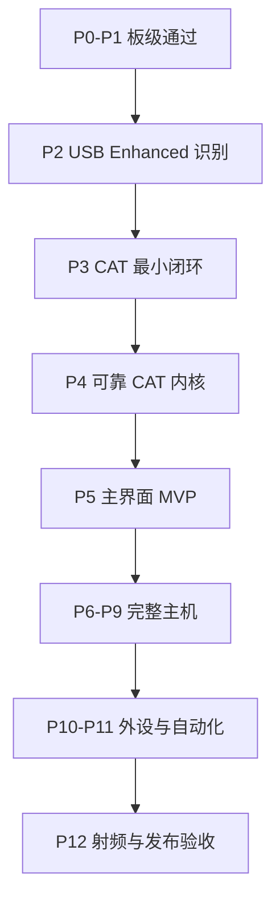

# FT-710 × ESP32-P4 扩展控制器

## 分阶段开发、测试与验收计划 v1.0

日期：2026-08-21  
依据：《FT710_ESP32P4_扩展控制器_可行性与架构方案_v1.0》

更新：2026-08-22 已完成本机 VSCode + ESP-IDF v5.5.5 环境修复，并在实机上完成 `08_lvgl_display_panel` 示例构建、烧写和启动日志验证。详见 [[07_开发环境与08_LVGL示例实测记录]]。

更新：2026-08-22 已完成 FT-710 直连本电脑的 CAT 与 USB Audio 实测。`COM5 Enhanced COM Port` 可稳定通信，`ID;` 返回 `ID0800;`，USB 接收音频可播放到电脑扬声器。详见 [[08_FT710_电脑直连_CAT与USB音频实测记录]]。

## 1. 计划目标

本计划把项目拆为 13 个可以独立验收的阶段。每个阶段都必须产生：

1. 可运行的固件或测试程序。
2. 测试记录和原始日志。
3. 明确的通过/不通过结论。
4. 可回退的版本标签或固件镜像。

基本规则：当前阶段未通过，不进入依赖它的下一阶段。特别是 USB/CAT 最小闭环未通过前，不开始正式 UI 和外壳设计；安全测试未通过前，不开放任何自动发射功能。

## 2. 总体阶段划分

| 阶段 | 名称 | 主要结果 | 建议工期 |
| --- | --- | --- | --- |
| P0 | 需求冻结与开发环境 | 可重复编译的空白工程 | 1～2 天 |
| P1 | 开发板基础验证 | 屏幕、触摸、存储、网络独立正常 | 2～3 天 |
| P2 | FT-710 USB 枚举探针 | 找到 CP2105 Enhanced 接口 | 2～5 天 |
| P3 | CAT 物理通信闭环 | `ID0800`、频率/模式稳定读写 | 3～7 天 |
| P4 | CAT 核心与状态模型 | 队列、解析、AI、轮询、重连 | 1～2 周 |
| P5 | 主界面 MVP | 完成日常核心操作 | 1～2 周 |
| P6 | 表头、告警与标定 | S/PO/SWR 显示和安全提示 | 3～7 天 |
| P7 | DSP 与深层菜单 | 常用接收参数、EX 白名单 | 1 周 |
| P8 | 实体旋钮与本地配置 | 编码器、按键、NVS 配置 | 3～7 天 |
| P9 | Wi-Fi、时间、日志与 OTA | 网络增强且离线不影响 CAT | 1 周 |
| P10 | RS485/CAN 外设层 | 旋转器/天调模拟器闭环 | 1～2 周 |
| P11 | 自动化规则引擎 | RX-only 自动联动和安全中止 | 1～2 周 |
| P12 | 整机、射频与发布验收 | 100 W 抗扰、长稳、发布包 | 1～2 周 |

不含外部旋转器/天调私有协议适配时，主机 MVP 预计 5～8 周；包含外设和自动化的完整版本预计 9～14 周。

## 3. 统一开发基线

### 3.1 固定版本

首个版本建议冻结：

- ESP-IDF：v5.5.5。2026-08-22 本机已安装并验证通过。
- Target：`esp32p4`。
- 微雪 BSP：`waveshare/esp32_p4_wifi6_touch_lcd_7b` 3.0.1 或项目开始时实际锁定版本。2026-08-22 示例构建解析到 3.0.1。
- LVGL：跟随微雪 BSP 已验证的 LVGL 9 版本。2026-08-22 示例构建解析到 LVGL 9.5.0。
- USB VCP：固定实际测试通过的 `usb_host_vcp` 版本。
- CP210x：从 `usb_host_cp210x_vcp` 2.2.0 开始验证。
- FT-710：记录 MAIN、DISPLAY、SDR、DSP 四项固件版本。

所有组件使用锁定文件，不能在开发过程中自动追踪最新版。

### 3.2 建议仓库结构

```text
ft710-controller/
├─ main/
├─ components/
│  ├─ board_support/
│  ├─ ft710_usb/
│  ├─ ft710_cat/
│  ├─ radio_state/
│  ├─ ui/
│  ├─ automation/
│  └─ external_bus/
├─ test/
│  ├─ host_parser/
│  ├─ cat_transcripts/
│  ├─ usb_descriptors/
│  └─ hardware_checklists/
├─ docs/
├─ tools/
└─ sdkconfig.defaults
```

### 3.3 必备测试设备

- ESP32-P4-WIFI6-Touch-LCD-7B 标准版。
- YAESU FT-710 与短 USB 2.0 A-B 屏蔽线。
- 可靠的 5 V/3 A USB-C 电源。
- Windows/Linux 电脑，用于先读取 FT-710 USB 描述符和串口行为。
- 50 Ω、额定功率不低于 100 W 的假负载。
- 独立功率/SWR 表。
- 万用表；建议准备 USB 电压电流表和逻辑分析仪。
- 两个带按键机械编码器。
- RS485/CAN USB 转换器或第二块开发板，用作外设模拟器。

## 4. P0：需求冻结与开发环境

### 开发内容

- 建立 ESP-IDF 工程、版本控制和自动构建。
- 从微雪最小工程/BSP 建立项目，不直接从空白 IDF 工程重写屏幕驱动。
- 固定依赖版本、分区表和基础 `sdkconfig.defaults`。
- 建立日志级别、错误码、构建版本号和硬件版本号规范。
- 首版编译时彻底关闭 `TX`、`MX`、CW keying、RTS/DTR PTT 功能。

### 测试

| 编号 | 测试内容 | 方法 | 合格结果 |
| --- | --- | --- | --- |
| P0-T01 | 干净环境构建 | 删除 build 后完整编译 | 零错误，生成 bootloader、partition、app 固件 |
| P0-T02 | 第二台电脑复现 | 按 README 建立环境并编译 | 固件哈希或构建内容一致，无隐含本地依赖 |
| P0-T03 | 安全编译检查 | 搜索固件可用命令表 | 不包含任何可触发发射的命令入口 |
| P0-T04 | 版本可追溯 | 启动串口日志 | 显示固件版本、构建时间、BSP/IDF 版本 |

### 必须得到的结果

- 一个任何开发人员都能重新编译的基础工程。
- `README_build.md`、依赖锁定文件、首个固件镜像。
- 发布门禁：P0 全部通过后进入 P1。

### 2026-08-22 实测状态

- 本机 ESP-IDF v5.5.5 环境已修复并可用。
- VSCode 已安装 Espressif ESP-IDF 扩展和 C/C++ 相关扩展。
- 已建立 `D:\CAT CONTROL\idf-v5.5.5.ps1` 作为 ESP-IDF 环境加载脚本。
- `08_lvgl_display_panel` 已完成 `idf.py build`，生成 bootloader、partition table 和 `lvgl_demo_v9.bin`。
- 实测芯片为 ESP32-P4 rev v1.3，示例已调整 `sdkconfig.defaults` 适配 v1.x 芯片。

## 5. P1：开发板基础功能验证

### 开发内容

- 运行微雪 `00_board_check`。
- 移植 `08_lvgl_display_panel`，验证 1024×600 MIPI-DSI 和 GT911。
- 验证背光 PWM、PSRAM、Flash、NVS、TF 卡、Wi-Fi。
- 建立统一 Board Self-Test 页面。

### 测试

| 编号 | 测试内容 | 方法 | 合格结果 |
| --- | --- | --- | --- |
| P1-T01 | LCD 色彩与全屏 | 红/绿/蓝/白/黑测试图 | 无错色、闪屏、花屏、固定坏块 |
| P1-T02 | 触摸定位 | 点击四角、中心和网格点各 20 次 | 坐标方向正确，平均误差≤10 px，无明显漂移 |
| P1-T03 | 多点触摸 | 两点拖动、五点同时按压 | 报告点数和坐标合理，无卡死 |
| P1-T04 | 背光 | 0～100%分级调节 | 无异常复位；低亮度无明显闪烁 |
| P1-T05 | PSRAM/Flash | 内存压力与读写校验 | 连续 30 分钟零校验错误 |
| P1-T06 | NVS | 写入、断电、读取 50 次 | 每次恢复正确，无分区损坏 |
| P1-T07 | TF 卡 | 反复写入/读取测试文件 | 100 次内容校验一致 |
| P1-T08 | Wi-Fi | 连接、断开、重连 50 次 | 自动恢复，不影响 UI 与触摸 |
| P1-T09 | 长时间运行 | LVGL 动画+触摸+Wi-Fi 运行 8 小时 | 无崩溃、看门狗、明显内存持续下降 |

### 必须得到的结果

- `board_self_test` 固件。
- 屏幕、触摸、PSRAM、NVS、TF、Wi-Fi 的测试记录。
- 明确的屏幕方向、触摸坐标和背光控制参数。

### 2026-08-22 实测状态

- `08_lvgl_display_panel` 已烧写到 `COM4` 并成功启动。
- monitor 日志确认 32 MB PSRAM、MIPI DSI、EK79007 LCD、GT911 触摸和 LVGL task 初始化成功。
- 背光日志显示已设置为 100%。
- 仍需补充人工观察记录：红/绿/蓝/白画面、触摸黑色轨迹、四角/中心触摸坐标、多点触摸和长时间运行。

## 6. P2：FT-710 USB 枚举探针

这是整个项目第一个关键技术门槛。

### 开发内容

- 初始化 ESP32-P4 Type-A USB Host 和 VBUS。
- 编写 `ft710_usb_probe`，打印 device/config/interface/endpoint/string descriptors。
- 识别 CP2105 Enhanced 与 Standard 两个接口。
- 保存 FT-710 实机 VID、PID、序列号、接口号、接口字符串和端点地址。
- 首版只允许 claim Enhanced 接口。

### 测试

| 编号 | 测试内容 | 方法 | 合格结果 |
| --- | --- | --- | --- |
| P2-T01 | VBUS | 空载与连接 FT-710 测量 | USB 设备能稳定检测，不反复上下线 |
| P2-T02 | USB 枚举 | 开电台后插线 | 完整读取所有描述符，无枚举错误 |
| P2-T03 | 双接口识别 | 比较接口字符串和 endpoint | 能明确区分 Enhanced/CAT-1 与 Standard/CAT-2 |
| P2-T04 | 接口认领 | 只 claim Enhanced | Standard 未被打开，RTS/DTR 未变化 |
| P2-T05 | 热插拔 | 插拔 USB 100 次 | 每次能重新枚举；无内存泄漏、死机 |
| P2-T06 | 开关电台 | USB 保持连接，开关 FT-710 50 次 | Host 能检测离线并自动重新连接 |
| P2-T07 | 安全监视 | 全程观察 FT-710 TX 指示 | 绝不进入发射状态 |

### 必须得到的结果

- 一份真实 FT-710 USB 描述符快照，保存为测试 fixture。
- 已确认 Enhanced 接口选择规则，不能依靠猜测。
- 如果现成 CP210x 驱动不能选择接口，形成明确的驱动补丁需求和失败日志。
- P2 未通过时停止 UI 开发，不进入 P3。

### 2026-08-22 电脑侧基准

- Windows 枚举到 `COM5 = Enhanced COM Port`，`COM6 = Standard COM Port`。
- Enhanced 接口 PNP 路径包含 `USB\VID_10C4&PID_EA70&MI_00`。
- Standard 接口 PNP 路径包含 `USB\VID_10C4&PID_EA70&MI_01`。
- ESP32-P4 侧 USB Host 探针应以此为基准，优先认领 `MI_00` / Enhanced 接口，避免打开 Standard 接口。

## 7. P3：CAT 物理通信最小闭环

### 开发内容

- 配置 Enhanced 端口为 38400、8N2、无流控。
- 实现最小 Bulk IN/OUT 收发和按分号组帧。
- 测试 `ID`、`FA`、`MD`、`PC`、`VE` 指令。
- 增加串口参数设置，以便兼容电台侧被修改的 CAT 参数。

### 测试

| 编号 | 测试内容 | 方法 | 合格结果 |
| --- | --- | --- | --- |
| P3-T01 | 机型识别 | 发送 `ID;` | 收到并正确解析 `ID0800;` |
| P3-T02 | 固件版本 | 发送 `VE0;`～`VE3;` | 四项版本均能读取并保存 |
| P3-T03 | 频率读取 | 在 FT-710 面板改变频率后发送 `FA;` | 返回值与电台显示一致到 1 Hz |
| P3-T04 | 频率写入 | 写入 7.100、14.250、21.300 MHz 后读回 | 每次写入正确，无多余字符或错位 |
| P3-T05 | 模式读写 | 测试 LSB/USB/DATA-U/FM | 电台模式与返回值一致 |
| P3-T06 | 功率设定 | 在假负载条件外仅修改设定，不发射 | `PC;` 读回与设定一致 |
| P3-T07 | 连续命令 | 10,000 次读命令循环 | 无解析崩溃；有效应答率≥99.9% |
| P3-T08 | 异常参数 | 故意使用错误波特率/停止位 | UI/日志明确报告连接失败，不死机 |
| P3-T09 | 安全 | 全程观察 TX 状态 | CAT 测试不触发发射 |

### 必须得到的结果

- `ft710_cat_minimal` 固件。
- 已验证的串口参数和 FT-710 固件版本记录。
- 频率、模式、功率读写闭环。
- CP2105 驱动若有修改，必须形成独立组件和说明，不能散落在应用代码中。

### 2026-08-22 电脑侧基准

- 串口参数 `38400 8N2 no flow control` 已在电脑侧验证可用。
- `ID; -> ID0800;` 已确认。
- `FA;`、`FB;`、`MD0;`、`MD1;`、`PC;`、`NR0;`、`RL0;`、`VE0;`～`VE3;` 已在电脑侧验证。
- VFO-A 频率写入、VFO-B 频率写入、VFO-A/B USB 模式设置和 DNR 设置均已验证。

## 8. P4：CAT 核心、队列与状态模型

### 开发内容

- 建立单一 CAT 发送调度器，触摸、轮询和自动化均只能通过它发送。
- 每次只允许一个需要应答的请求在途。
- 实现优先级队列、超时、有限重试、取消、热插拔恢复。
- 建立环形缓冲区和分号组帧，处理半包、粘包、乱序到达和 AI 主动上报。
- 建立 `RadioState` 单一事实源。
- 实现 `AI1;`、初始全量同步和 RX/TX 动态轮询。

### 主机单元测试

不连接电台，在电脑上对 CAT parser/state model 运行自动测试。

| 编号 | 测试内容 | 方法 | 合格结果 |
| --- | --- | --- | --- |
| P4-T01 | 半包 | 将一条应答分成任意字节段输入 | 只在收到 `;` 后产生一条完整消息 |
| P4-T02 | 粘包 | 一次输入 2～20 条应答 | 每条均正确分离，顺序不变 |
| P4-T03 | AI 交错 | 请求应答中间插入主动状态 | 应答匹配正确，AI 同时更新状态 |
| P4-T04 | 非法数据 | 随机字节、超长帧、缺少分号 | 丢弃异常并记录，不能越界或崩溃 |
| P4-T05 | 超时 | 模拟电台不响应 | 超时后有限重试，最终进入可恢复错误状态 |
| P4-T06 | 队列优先级 | 同时提交触摸、轮询、自动化命令 | 用户命令优先；轮询可合并/取消 |
| P4-T07 | 写后确认 | 模拟写入成功/失败/返回不同值 | UI 只在确认后提交最终状态，失败恢复旧值 |
| P4-T08 | 模糊测试 | 随机切分和输入十万条帧 | 零崩溃、零越界、零状态结构损坏 |

### 实机测试

| 编号 | 测试内容 | 方法 | 合格结果 |
| --- | --- | --- | --- |
| P4-T09 | 面板同步 | 快速旋转 FT-710 旋钮、改变模式 | 屏幕状态通常在 300 ms 内更新 |
| P4-T10 | 控制确认 | 连续点击模式/波段/功率 | 500 ms 内确认；失败有明确提示 |
| P4-T11 | 断线恢复 | 通信中拔线后重新插入 | 自动重连并全量同步，旧命令不重放 |
| P4-T12 | 电台关机 | AI 开启时关闭再开机 | 重连后自动重新发送 `AI1;` |
| P4-T13 | 长稳 | 全状态同步运行 24 小时 | 无死机；无持续内存泄漏；无队列堵塞 |

### 必须得到的结果

- 可脱离 UI 独立运行的 `ft710_cat`、`radio_state` 组件。
- CAT parser 自动测试集和 FT-710 实机 transcript。
- 24 小时稳定性报告。

## 9. P5：主界面 MVP

### 开发内容

- 顶部状态栏：USB、Wi-Fi、蓝牙、时间、RX/TX。
- 大号 VFO-A 频率显示。
- `LSB / USB / DATA / FM` 四模式按钮。
- `3.5 / 7 / 14 / 21 / 28 / 50 MHz` 六波段按钮。
- RF Power、AF Gain、RF Gain、IPO/ATT/AGC。
- DNR 开关和 01～15 左右箭头，开启青色、关闭灰色。
- 通信断线、写入失败、参数不可用的统一视觉状态。

### 测试

| 编号 | 测试内容 | 方法 | 合格结果 |
| --- | --- | --- | --- |
| P5-T01 | 触摸命中 | 每个按钮连续点击 100 次 | 无相邻按钮误触；有效点击均被识别 |
| P5-T02 | 模式按钮 | 四模式循环 100 次 | 高亮状态与 FT-710 始终一致 |
| P5-T03 | 波段按钮 | 六波段循环 50 次 | 每次切换到正确波段栈，无错码 |
| P5-T04 | DNR | 开关并调节 01～15 | 颜色、数值、电台状态同步 |
| P5-T05 | 滑块/连续调节 | AF/RF/Power 快速拖动 | 命令经过节流，不堵塞 CAT 队列 |
| P5-T06 | 面板竞争 | 同时在电台与触屏改变同一参数 | 最终以电台确认状态为准，无来回振荡 |
| P5-T07 | UI 性能 | 运行实时状态与触控 8 小时 | 无明显卡顿、撕裂、触摸失效或看门狗复位 |
| P5-T08 | 断线界面 | 拔掉 FT-710 USB | 控件立即进入不可写状态，保留最后值但标为离线 |

### 必须得到的结果

- 可以日常操作频率、模式、波段、功率和 DNR 的 MVP 固件。
- 可进行第一次真实使用评审的完整横屏界面。
- 这是“主机最小可用版本”里程碑。

## 10. P6：表头、SWR/功率标定与安全告警

### 开发内容

- RX 时轮询 `SM0;`；TX 时轮询 `RM5;`、`RM6;` 和 `RI0;`。
- 实现 S Meter、PO、SWR 原始表盘。
- 实现 Hi-SWR、TX、TX INHIBIT 和 Tuner 状态提示。
- 建立原始值到显示值的可配置标定表，不在代码中写死未经验证公式。

### 测试安全前提

所有发射测试先接 50 Ω、≥100 W 假负载和独立功率/SWR 表；确认散热和驻波后再提高功率。不得在未接负载时发射。

### 测试

| 编号 | 测试内容 | 方法 | 合格结果 |
| --- | --- | --- | --- |
| P6-T01 | RX S Meter | 输入不同强度信号或观察实际信号 | `SM0` 原始值稳定随信号变化，无冻结 |
| P6-T02 | TX 自动切换 | 5 W 短时发射 | 300 ms 内从 S 表切到 PO/SWR，停止后切回 |
| P6-T03 | 功率点 | 5/10/25/50/75/100 W 测试 | 保存 `RM5` 与外部功率计对应数据 |
| P6-T04 | SWR 点 | 使用安全可控负载/调谐条件获取多点 | 保存 `RM6` 与外部 SWR 表对应数据 |
| P6-T05 | 重复性 | 每个标定点重复 5 次 | 原始值离散范围可接受并有记录 |
| P6-T06 | Hi-SWR | 在安全功率下模拟高驻波 | `RI0` 告警立即显示，自动化进入禁止状态 |
| P6-T07 | 通信丢失 | TX 表头读取过程中拔线 | UI 标记数据失效，不保留为“实时值”误导用户 |

### 必须得到的结果

- 原始 S/PO/SWR 表盘完全可用。
- 一份特定 FT-710 的功率和 SWR 标定数据表。
- 若建立数值换算，目标建议：功率显示误差≤±10%；常用区间 SWR 误差≤±0.2。达不到则只显示表盘和区间，不显示伪精确数值。

## 11. P7：DSP 参数与深层菜单

### 开发内容

- 增加 Width、Shift、NB、DNF、Contour、Notch、NAR、AGC 等页面。
- 按模式建立带宽值映射，避免同一 `SH` 索引在不同模式下显示错误单位。
- 建立 `EX` 菜单白名单，只允许报告中已经确认并经过实机验证的菜单项。
- 每个控件定义允许范围、步进、格式化和回读命令。

### 测试

| 编号 | 测试内容 | 方法 | 合格结果 |
| --- | --- | --- | --- |
| P7-T01 | Width 映射 | 在 LSB/USB/CW/DATA/AM/FM 分别测试 | 显示带宽和电台实际值一致 |
| P7-T02 | Shift | 测试 -1200～+1200 Hz | 方向、步进和回读正确 |
| P7-T03 | DSP 开关 | NB/DNF/Contour/NAR 循环切换 | 开关和等级互不串扰 |
| P7-T04 | EX 白名单 | 对所有允许菜单逐一读写 | 只修改目标菜单，其他设置不变 |
| P7-T05 | EX 越界 | 输入超范围和未授权索引 | 本地拒绝，命令不发送到 FT-710 |
| P7-T06 | 模式切换 | 参数页打开时切换模式 | 不兼容控件自动禁用或重新映射 |

### 必须得到的结果

- 常用深层菜单可以直接触控操作。
- 一份经过实机验证的 CAT/EX 白名单表。
- 未验证的 EX 项目不能进入发布版。

## 12. P8：实体编码器、按键与配置持久化

### 开发内容

- 主频率编码器：慢转精调、快转加速、按压切换步进。
- 多功能编码器：根据当前页面控制 DNR/Width/Shift/Power 等。
- GPIO 中断只采集事件，去抖、加速和 CAT 写入在任务中处理。
- 将 CAT 参数、DATA 模式、亮度、主题、Wi-Fi 和用户偏好保存到 NVS。

### 测试

| 编号 | 测试内容 | 方法 | 合格结果 |
| --- | --- | --- | --- |
| P8-T01 | 编码器计数 | 正反各旋转 1,000 个机械步 | 无持续丢步或方向错误 |
| P8-T02 | 快速旋转 | 不同速度旋转 | 加速曲线可控，不产生巨大跳频 |
| P8-T03 | 按键去抖 | 短按/长按各 200 次 | 每次只产生一个正确事件 |
| P8-T04 | 触摸与旋钮并发 | 同时操作相同参数 | CAT 队列不堵塞，最终状态一致 |
| P8-T05 | 配置保存 | 修改后断电 50 次 | 每次恢复正确；损坏时能回默认值 |
| P8-T06 | 写入寿命策略 | 连续旋转参数 | 不对每个机械步立即写 Flash，使用延时合并 |

### 必须得到的结果

- 可在不盯着触摸屏的情况下完成调谐和常用参数调节。
- 配置可靠保存且不会因高频写入损耗 Flash。

## 13. P9：Wi-Fi、时间、日志与 OTA

### 开发内容

- 通过 ESP32-C6/ESP-Hosted 接入 2.4 GHz Wi-Fi。
- NTP 校时、时区设置和顶部时间显示。
- CAT/USB 故障日志、环形事件记录和诊断导出。
- 双 OTA 分区、签名/校验、失败回滚。
- 网络模块与 CAT 控制完全解耦：没有网络时必须能正常控制电台。

### 测试

| 编号 | 测试内容 | 方法 | 合格结果 |
| --- | --- | --- | --- |
| P9-T01 | Wi-Fi 重连 | 路由器断电/恢复 50 次 | 自动恢复；CAT 和 UI 始终可用 |
| P9-T02 | 弱网 | 丢包、高延迟、DNS 失败 | 网络任务不阻塞 UI/CAT |
| P9-T03 | NTP | 冷启动和网络恢复 | 联网后校时；离线期间 RTC 连续运行 |
| P9-T04 | 日志 | 制造 USB/CAT 超时、断线 | 记录时间、错误码、最近命令，不泄露 Wi-Fi 密码 |
| P9-T05 | 正常 OTA | 上传有效固件 | 自动切换并保留用户配置 |
| P9-T06 | 失败 OTA | 断电或使用损坏镜像 | 回滚到旧版本，设备仍可启动 |
| P9-T07 | 版本兼容 | OTA 后检查 C6 Hosted 通信 | Wi-Fi 与 C6 固件版本兼容，无反复重启 |

### 必须得到的结果

- 网络增强功能可用，但网络故障不影响本地控制。
- 可恢复的 OTA 和可导出的诊断日志。

## 14. P10：RS485/CAN 外设层

### 开发内容

- 先建立与品牌无关的 `Rotator`、`Tuner`、`AccessoryBus` 接口。
- 使用第二块板或 PC 工具制作旋转器/天调模拟器。
- 验证 RS485 自动方向、CAN/TWAI 帧、超时、CRC、重连。
- 后续再为实际旋转器/天调增加协议适配器。

### 测试

| 编号 | 测试内容 | 方法 | 合格结果 |
| --- | --- | --- | --- |
| P10-T01 | RS485 回环 | 连续收发 100,000 帧 | CRC 错误率为 0 或有明确线路故障记录 |
| P10-T02 | CAN 回环 | 不同 ID/长度/频率压力测试 | 无总线锁死；错误计数和恢复正常 |
| P10-T03 | 位置反馈 | 模拟器返回 0～360° | UI 位置、目标和运动方向正确 |
| P10-T04 | 限位 | 模拟触发左右/机械限位 | 立即停止继续运动命令 |
| P10-T05 | 通信中断 | 运动中拔掉总线 | 超时停止，UI 报警，不继续盲发 |
| P10-T06 | 非法数据 | CRC 错误、越界角度、重复帧 | 拒绝并记录，不改变安全状态 |

### 必须得到的结果

- 旋转器/天调的软件抽象层和模拟器。
- 在没有真实外设时也能自动回归测试。
- 实际设备型号确定后，只增加协议 adapter，不修改 CAT/UI 核心。

## 15. P11：自动化规则引擎

### 开发内容

- 建立统一候选记录：频率、模式、呼号、位置、时间、可信度、来源。
- 实现频率/模式设置、方位计算、旋转器控制、到位确认和调谐流程。
- 首版自动化限定为 RX-only；网络数据不能直接发送 CAT 或外设命令。
- 建立安全状态机：Idle → Set Radio → Rotate → Wait Position → User Confirm → Tune → Monitor/Abort。

### 测试

| 编号 | 测试内容 | 方法 | 合格结果 |
| --- | --- | --- | --- |
| P11-T01 | 正常流程 | 用模拟器输入合法欧洲台站记录 | 频率、模式、方位按顺序设置 |
| P11-T02 | 无效频率 | 输入超出允许范围的数据 | 只提示，不发送命令 |
| P11-T03 | 旧数据 | 输入过期记录 | 标记过期，不自动执行 |
| P11-T04 | 旋转器不到位 | 模拟超时/限位 | 流程停止，不进入调谐 |
| P11-T05 | Hi-SWR | 调谐中模拟 `RI0` 高驻波 | 立即中止并锁定后续动作 |
| P11-T06 | USB 断线 | 流程中断开 FT-710 | 自动化取消，重连后不重放旧命令 |
| P11-T07 | 网络断线 | 已开始本地安全动作时断网 | 安全停止或完成当前无风险步骤，不失控 |
| P11-T08 | 发射审计 | 检查全部自动化命令日志 | RX-only 版本中绝无 `TX`、`MX`、PTT 命令 |

### 必须得到的结果

- 可在模拟环境重复执行的自动化状态机。
- 每次自动化操作都有来源、条件、执行命令、确认结果和中止原因记录。
- 未经单独安全评审，不进入自动发射阶段。

## 16. P12：整机、射频抗扰与发布验收

### 开发内容

- 完成外壳、电源、USB/RS485/CAN/编码器线束和散热设计。
- 进行 100 W 发射环境下的 USB、触摸、显示、网络和外设抗扰测试。
- 完成看门狗、棕断、异常复位、恢复模式和出厂测试页面。
- 形成生产固件、恢复固件、烧录说明和用户说明。

### 射频与可靠性测试

| 编号 | 测试内容 | 方法 | 合格结果 |
| --- | --- | --- | --- |
| P12-T01 | 各波段抗扰 | 假负载下从低功率逐步到 100 W，覆盖 3.5/7/14/21/28/50 MHz | USB 不掉线、无幽灵触摸、无异常复位 |
| P12-T02 | USB 线缆 | 比较普通线、带磁环线和不同布线 | 确定稳定线缆及走线规范 |
| P12-T03 | 连续运行 | UI+CAT+Wi-Fi+外设运行 7 天 | 无死机；无不可恢复断线；内存稳定 |
| P12-T04 | 电源循环 | 断电/上电 500 次 | 每次正常启动；配置和文件系统无损坏 |
| P12-T05 | 棕断 | 缓慢降压和瞬时跌落 | 安全复位，不产生错误 CAT 命令 |
| P12-T06 | 看门狗 | 人为阻塞任务 | 设备恢复并保存可诊断原因 |
| P12-T07 | OTA 回滚 | 安装故障测试镜像 | 自动回滚到可用版本 |
| P12-T08 | 安全终验 | 开机、重连、升级、异常复位全流程监视 | 任何异常流程均不触发发射 |
| P12-T09 | 用户场景 | 连续完成调频、换模式、换波段、DNR、旋转器流程 | 无需进入 FT-710 深层菜单即可完成目标操作 |

### 必须得到的结果

- 通过验收的整机固件和硬件装配方案。
- 7 天长稳报告、各波段射频抗扰报告、功率/SWR 标定文件。
- 生产固件、恢复固件、版本说明、用户手册和已知限制清单。

## 17. 阶段门禁



硬门禁定义：

| 门禁 | 允许进入下一阶段的条件 |
| --- | --- |
| G1 板级门禁 | P1 所有必测项通过，8 小时无异常 |
| G2 USB 门禁 | 能稳定认领 Enhanced，100 次热插拔，零误发射 |
| G3 CAT 门禁 | `ID0800`、FA/MD/PC 稳定读写，10,000 次命令通过 |
| G4 MVP 门禁 | 24 小时状态同步稳定，主界面核心功能通过 |
| G5 安全门禁 | Hi-SWR/掉线/超时/限位均能安全中止 |
| G6 发布门禁 | 7 天长稳、500 次电源循环、各波段 100 W 抗扰通过 |

## 18. 每阶段统一测试记录格式

每次测试至少记录：

```text
测试编号：
日期/执行人：
硬件版本：
ESP-IDF/BSP/应用版本：
FT-710 四项固件版本：
电台 CAT 参数：
连接方式与线缆：
测试前置条件：
操作步骤：
预期结果：
实际结果：
原始日志/照片/视频位置：
是否通过：
异常编号与处理：
```

## 19. 建议立即开始的工作

第一轮只做 P0～P3，不做正式 UI：

1. 固定 ESP-IDF/BSP 版本并跑通官方板级示例。
2. 建立 `ft710_usb_probe`。
3. 取得真实 USB 描述符，确认 Enhanced interface number 和 endpoint。
4. 实现 `ID; FA; MD0; PC; VE0～VE3` 最小闭环。
5. 完成 100 次热插拔和零误发射测试。

完成后应得到一个明确结论：现成 CP210x 组件可直接使用，或需要哪一处接口选择补丁。这个结论决定后续正式固件结构，是项目当前最重要的开发输出。
