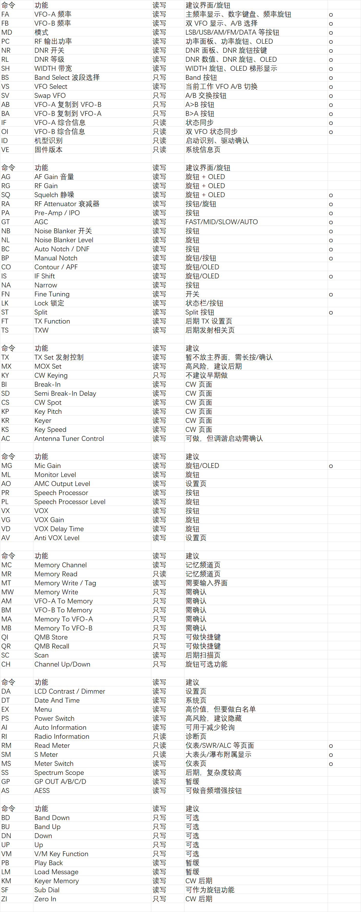
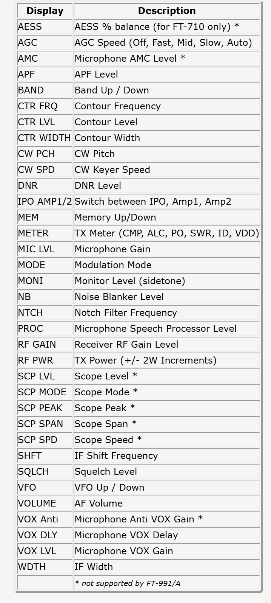

# 2026-09-04 FT-710 功能池与配置框架

## 本次输入

用户提供了两张功能规划图：





用户说明：计划做这些功能。

本次处理目标不是一次性实现所有功能，而是把这些功能整理成项目的“功能池”，并与已经建立的五组“旋钮 + OLED”槽位框架对齐。

## 总体设计原则

功能需要分成三层：

1. CAT/Radio 功能层

   只关心电台能力，例如频率、模式、DNR、功率、WIDTH、AGC、SWR 表、记忆频道等。

2. UI/交互层

   决定某个功能适合用什么方式操作：

   - 主屏大面板
   - 按钮
   - 旋钮
   - OLED
   - 设置页
   - 记忆频道页
   - 发射/高风险确认页

3. 硬件槽位层

   只描述硬件：

   - 旋钮 A/B/S 接哪个 MCP23017 引脚
   - OLED 接 TCA9548A 哪个通道
   - 当前槽位绑定哪个功能

这样后续更换功能时，不需要改 MCP23017 读取逻辑，也不需要改 OLED 初始化逻辑，只需要改配置绑定。

## 当前代码抽象

本次在 `ft710_controller/components/app_controller/app_controller.c` 中新增/扩展：

```c
typedef enum {
    CONTROL_FN_FREQUENCY,
    CONTROL_FN_VFO_B_FREQUENCY,
    CONTROL_FN_MODE,
    CONTROL_FN_DNR,
    CONTROL_FN_DNR_LEVEL,
    CONTROL_FN_POWER,
    CONTROL_FN_WIDTH,
    ...
    CONTROL_FN_SLOT_TEST,
} control_function_t;
```

新增功能分组：

```c
typedef enum {
    FEATURE_GROUP_CORE,
    FEATURE_GROUP_RX_DSP,
    FEATURE_GROUP_TX_AUDIO,
    FEATURE_GROUP_MEMORY,
    FEATURE_GROUP_SYSTEM,
    FEATURE_GROUP_METER,
    FEATURE_GROUP_NAVIGATION,
    FEATURE_GROUP_TX_RISK,
} feature_group_t;
```

新增 UI 适配标记：

```c
typedef enum {
    FEATURE_UI_MAIN_PANEL,
    FEATURE_UI_BUTTON,
    FEATURE_UI_ENCODER,
    FEATURE_UI_OLED,
    FEATURE_UI_PAGE,
    FEATURE_UI_CONFIRM,
    FEATURE_UI_STATUS_BAR,
} feature_ui_flags_t;
```

新增功能目录项：

```c
typedef struct {
    control_function_t function;
    const char *cat_cmd;
    const char *display;
    const char *description;
    feature_group_t group;
    feature_access_t access;
    uint32_t ui_flags;
    bool implemented;
} feature_catalog_item_t;
```

新增 `s_feature_catalog[]`，作为未来配置菜单的数据源。

## 当前 5 组槽位默认绑定

| 组 | 硬件 | 当前默认功能 | 状态 |
|---|---|---|---|
| 组 1 | 旋钮 1 + OLED 1 | 频率输入/显示 | 已实现 |
| 组 2 | 旋钮 2 + OLED 2 | DNR | 已实现 |
| 组 3 | 旋钮 3 + OLED 3 | RF Power | 已实现 |
| 组 4 | 旋钮 4 + OLED 4 | WIDTH | 已实现 |
| 组 5 | 旋钮 5 + OLED 5 | Slot Test 数字加减 | 已实现为硬件测试 |

后续目标：这 5 组都可在主控配置界面中自由选择功能。

## 功能池分类

### 1. 核心主屏功能

这些功能适合放在主屏，属于最常用控制。

| 命令 | 功能 | 读写 | 建议交互 | 当前状态 |
|---|---|---|---|---|
| FA | VFO-A 频率 | 读写 | 主频显示、数字键盘、频率旋钮、OLED | 已实现 |
| FB | VFO-B 频率 | 读写 | 双 VFO 显示、A/B 选择 | 已实现 |
| MD | 模式 | 读写 | LSB/USB/AM/FM/DATA 等按钮 | 已实现 |
| PC | RF 输出功率 | 读写 | 功率面板、功率旋钮、OLED | 已实现 |
| NR | DNR 开关 | 读写 | DNR 面板、DNR 旋钮按键 | 已实现 |
| RL | DNR 等级 | 读写 | DNR 数值、DNR 旋钮、OLED | 已实现 |
| SH | WIDTH 带宽 | 读写 | WIDTH 旋钮、OLED 图形显示 | 已实现 |
| BS | Band Select 波段选择 | 只写 | Band 按钮 | 已实现为项目默认频率写入 |
| VS | VFO Select | 读写 | 当前工作 VFO A/B 切换 | 已实现 |
| SV | Swap VFO | 只写 | A/B 交换按钮 | 已实现 |
| AB | VFO-A 复制到 VFO-B | 只写 | A>B 按钮，需确认 | 待实现 |
| BA | VFO-B 复制到 VFO-A | 只写 | B>A 按钮，需确认 | 待实现 |
| IF | VFO-A 综合信息 | 只读 | 状态同步 | 待实现 |
| OI | VFO-B 综合信息 | 只读 | 双 VFO 状态同步 | 待实现 |
| ID | 机型识别 | 只读 | 启动识别、驱动确认 | 已测试 |
| VE | 固件版本 | 只读 | 系统信息页 | 待实现 |

### 2. 接收/DSP 功能

这些功能适合进入“可配置旋钮/OLED”池，也适合做接收控制页面。

| 命令 | 功能 | 读写 | 建议交互 |
|---|---|---|---|
| AG | AF Gain 音量 | 读写 | 旋钮 + OLED |
| RG | RF Gain | 读写 | 旋钮 + OLED |
| SQ | Squelch 静噪 | 读写 | 旋钮 + OLED |
| RA | RF Attenuator 衰减器 | 读写 | 按钮/旋钮 |
| PA | Pre-Amp / IPO | 读写 | 按钮 |
| GT | AGC | 读写 | FAST/MID/SLOW/AUTO |
| NB | Noise Blanker 开关 | 读写 | 按钮 |
| NL | Noise Blanker Level | 读写 | 旋钮 |
| BC | Auto Notch / DNF | 读写 | 按钮 |
| BP | Manual Notch | 读写 | 旋钮/按钮 |
| CO | Contour / APF | 读写 | 旋钮/OLED |
| IS | IF Shift | 读写 | 旋钮/OLED |
| NA | Narrow | 读写 | 按钮 |
| FN | Fine Tuning | 读写 | 开关 |
| LK | Lock 锁定 | 读写 | 状态栏/按钮 |
| ST | Split | 读写 | Split 按钮 |

### 3. 发射与高风险功能

这些功能涉及发射、自动发射或可能改变发射行为，不放主屏直接触发，需要确认页或后期专门页面。

| 命令 | 功能 | 读写 | 建议 |
|---|---|---|---|
| TX | TX Set 发射控制 | 读写 | 暂不放主界面，需要长按/确认 |
| MX | MOX Set | 读写 | 高风险，建议后期实现 |
| KY | CW Keying | 只写 | 不建议早期做 |
| BI | Break-In | 读写 | CW 页面 |
| SD | Semi Break-In Delay | 读写 | CW 页面 |
| CS | CW Spot | 读写 | CW 页面 |
| KP | Key Pitch | 读写 | CW 页面 |
| KR | Keyer | 读写 | CW 页面 |
| KS | Key Speed | 读写 | CW 页面 |
| AC | Antenna Tuner Control | 读写 | 可做，但启动调谐需确认 |
| FT | TX Function | 读写 | 后期 TX 设置页 |
| TS | TXW | 读写 | 后期发射相关页 |

### 4. 发射音频/语音功能

这些功能适合做单独的 TX Audio 页面，部分可以放到可配置旋钮。

| 命令 | 功能 | 读写 | 建议 |
|---|---|---|---|
| MG | Mic Gain | 读写 | 旋钮/OLED |
| ML | Monitor Level | 读写 | 旋钮 |
| AO | AMC Output Level | 读写 | 设置页 |
| PR | Speech Processor | 读写 | 按钮 |
| PL | Speech Processor Level | 读写 | 旋钮 |
| VX | VOX | 读写 | 按钮 |
| VG | VOX Gain | 读写 | 旋钮 |
| VD | VOX Delay Time | 读写 | 旋钮 |
| AV | Anti VOX Level | 读写 | 设置页 |
| AS | AESS | 读写 | 音频增强按钮 |

### 5. 记忆频道功能

这些功能适合后续做“频道/台站数据库”页面，并与 WiFi 数据库同步结合。

| 命令 | 功能 | 读写 | 建议 |
|---|---|---|---|
| MC | Memory Channel | 读写 | 记忆频道页 |
| MR | Memory Read | 只读 | 记忆频道页 |
| MT | Memory Write / Tag | 读写 | 需要输入界面 |
| MW | Memory Write | 只写 | 需确认 |
| AM | VFO-A To Memory | 只写 | 需确认 |
| BM | VFO-B To Memory | 只写 | 需确认 |
| MA | Memory To VFO-A | 只写 | 需确认 |
| MB | Memory To VFO-B | 只写 | 需确认 |
| QI | QMB Store | 只写 | 可做快捷键 |
| QR | QMB Recall | 只写 | 可做快捷键 |
| SC | Scan | 读写 | 后期扫描页 |
| CH | Channel Up/Down | 只写 | 旋钮可选功能 |

### 6. 系统/状态/仪表功能

这些功能多数属于状态栏、系统信息页、仪表页。

| 命令 | 功能 | 读写 | 建议 |
|---|---|---|---|
| DA | LCD Contrast / Dimmer | 读写 | 设置页 |
| DT | Date And Time | 读写 | 系统页 |
| EX | Menu | 读写 | 高价值，但需要白名单 |
| PS | Power Switch | 读写 | 高风险，建议隐藏 |
| AI | Auto Information | 读写 | 可用于减少轮询 |
| RI | Radio Information | 只读 | 诊断页 |
| RM | Read Meter | 只读 | 仪表/SWR/ALC 页面 |
| SM | S Meter | 只读 | 大表头/瀑布附属显示 |
| MS | Meter Switch | 读写 | 仪表页 |
| SS | Spectrum Scope | 读写 | 后期，复杂度较高 |
| GP | GP OUT A/B/C/D | 读写 | 暂缓 |

### 7. 导航/快捷键功能

这些多为按键型功能，可作为可选快捷键。

| 命令 | 功能 | 读写 | 建议 |
|---|---|---|---|
| BD | Band Down | 只写 | 可选 |
| BU | Band Up | 只写 | 可选 |
| DN | Down | 只写 | 可选 |
| UP | Up | 只写 | 可选 |
| VM | V/M Key Function | 只写 | 可选 |
| PB | Play Back | 读写 | 暂缓 |
| LM | Load Message | 读写 | 暂缓 |
| KM | Keyer Memory | 读写 | CW 后期 |
| SF | Sub Dial | 只写 | 可作为旋钮功能 |
| ZI | Zero In | 只写 | CW 后期 |

## 可配置旋钮/OLED 优先候选

根据两张图和当前硬件，最适合放入 5 组槽位配置菜单的功能：

| 显示名 | 说明 | 建议控件 |
|---|---|---|
| VFO | VFO Up/Down | 旋钮 + OLED |
| RF PWR | TX Power | 旋钮 + OLED |
| DNR | DNR Level | 旋钮 + OLED |
| WDTH | IF Width | 旋钮 + OLED |
| VOLUME | AF Volume | 旋钮 + OLED |
| RF GAIN | Receiver RF Gain Level | 旋钮 + OLED |
| SQLCH | Squelch Level | 旋钮 + OLED |
| AGC | AGC Speed | 按键/旋钮 |
| IPO AMP1/2 | IPO / Amp1 / Amp2 | 按键 |
| NB | Noise Blanker | 按键 + 旋钮 |
| CTR LVL | Contour Level | 旋钮 + OLED |
| CTR FRQ | Contour Frequency | 旋钮 + OLED |
| CTR WIDTH | Contour Width | 旋钮 + OLED |
| SHFT | IF Shift Frequency | 旋钮 + OLED |
| MIC LVL | Microphone Gain | 旋钮 + OLED |
| MONI | Monitor Level | 旋钮 |
| PROC | Speech Processor Level | 旋钮/按钮 |
| MEM | Memory Up/Down | 旋钮 |
| METER | TX Meter / SWR / ALC | OLED/页面 |

## 推荐开发顺序

### 阶段 1：配置框架

- 保持当前 5 组默认功能。
- 新增配置页面雏形。
- 配置页面从 `s_feature_catalog[]` 读取功能列表。
- 每个槽位可以选择功能，但只允许选择 `implemented=true` 的功能。
- 配置保存到 NVS。

### 阶段 2：接收控制扩展

优先做不涉及发射风险的功能：

- AF Gain
- RF Gain
- Squelch
- AGC
- IPO/Preamp
- Noise Blanker
- IF Shift
- Contour
- Narrow
- Fine Tuning

### 阶段 3：仪表页

- S Meter
- PO 原始值
- SWR 原始值
- ALC 原始值
- TX/RX 状态
- Hi-SWR 告警

### 阶段 4：记忆频道/数据库

- Memory Channel
- Memory Read
- QMB Store/Recall
- WiFi 数据库同步频道列表和台站列表

### 阶段 5：发射相关功能

进入该阶段前需要完成：

- 明确安全确认 UI
- 发射超时保护
- Hi-SWR 停止
- CAT 掉线停止
- 功率限制
- 假负载/功率计/SWR 表实测

可逐步加入：

- TX 设置页
- Tuner 控制
- MOX
- CW 页面
- SWR 扫频测量

## SWR 扫频功能放置建议

扫频测量属于高风险自动发射功能，不应作为普通槽位直接触发。

建议做成独立页面：

- 起始频率
- 终止频率
- 步进
- 功率：5W/10W
- 模式固定 AM
- 单点发射时间
- 停止按钮
- SWR 曲线图
- 原始 `RM6` 记录
- 必须二次确认

在功能目录中可归入：

- `FEATURE_GROUP_METER`
- 或单独新增 `FEATURE_GROUP_MEASUREMENT`

## 本次代码意义

本次不是完成功能实现，而是建立可持续扩展的功能注册表。

后续主控配置界面可以直接从 `s_feature_catalog[]` 读取：

- 显示名称
- CAT 命令
- 是否读写
- 推荐 UI
- 是否已实现
- 是否需要确认
- 是否属于高风险发射功能

这样不会让 UI 配置、CAT 命令、硬件接线继续混在一起。
